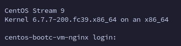
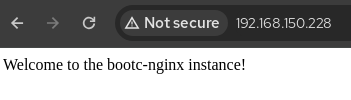

# Use Case - Applying a different image to an existing VM

Our team is looking to improve performances and test different configurations.
We created our new and shiny image with Apache HTTPD and MariaDB, but you are exploring alternatives and want to use [Nginx](https://www.nginx.com/) and [PostgreSQL](https://www.postgresql.org/) as some of your team members are more familiar with that stack.

We will then create an alternative image, with a dedicated tag, that will help our fellow colleagues in their efforts.
Instead of redeploying the VM from scratch, we are going to use **bootc** to change the reference of the image in our existing VM to use it for configuring the system!


The [Containerfile](./Containerfile.replace) will be very close to the [previous one](../anaconda-ks-bootc-container/Containerfile.anaconda):

- Updates packages
- Installs tmux and mkpasswd to create a simple user password
- Creates a *bootc-user* user in the image
- Adds the wheel group to sudoers
- Installs nginx server
- Enables the systemd unit for nginx
- Adds a custom index.html
- Customizes the Message of the day
- Add an additional message of the day with the new release notes
- Add postgresql-server package and vim
- Enable the postgresql-server systemd unit

Since the *bootc switch* command will preserve the /var and /etc content, we will use a workaround to create the needed dirs for Nginx and Postgresql leveraging [systemd-tmpfiles](./files/tmpfiles.d/) and [systemd-sysusers](./files/sysusers.d/) to ensure users are in place.

## Building the image

You can build the image right from the Containerfile using Podman:

```bash
podman build -f Containerfile.replace -t centos-bootc-vm:nginx .
```

## Testing the image

You can now test it using:

```bash
podman run -it --name centos-bootc-vm-nginx --hostname centos-bootc-vm-nginx -p 8080:80 -p 5432:5432 centos-bootc-vm:nginx
```

Note: The *"-p 8080:80" -p 5432:5432* part forwards the container's *http* and *postgresql* port to the port 8080 and 3306 on the host to test that nginx and postgresql are working.

The contaienr will now start and a login prompt will appear:



### Testing Nginx

On another terminal tab or in your browser, you can verify that the httpd server is working and serving traffic.

**Terminal**

```bash
 ~ ▓▒░ curl localhost:8080                                                                                                           ░▒▓ ✔  11:59:44
Welcome to the bootc-nginx instance!
```

**Browser**


### Testing Postgresql

From the login prompt, login as **bootc-user/hostadmin** and impersonate the root user:

```bash
[bootc-user@centos-bootc-vm-nginx ~]$ sudo -i
[root@centos-bootc-vm-nginx ~]#
```

Initialize PostgreSQL db and config:

```bash
[root@centos-bootc-vm-nginx ~]# postgresql-setup --initdb
 * Initializing database in '/var/lib/pgsql/data'
 * Initialized, logs are in /var/lib/pgsql/initdb_postgresql.log
```

You will now be able to restart the postgresql systemd unit and test the connection:

```bash
[root@centos-bootc-vm-nginx ~]# systemctl restart postgresql
[root@centos-bootc-vm-nginx ~]# su - postgres
[postgres@centos-bootc-vm-nginx ~]$ psql
psql (13.11)
Type "help" for help.

postgres=#
```

## Tagging and pushing the image

To tag and push the image you can simply run (replace **YOURQUAYUSERNAME** with the account name):


```bash
export QUAY_USER=YOURQUAYUSERNAME
```

```bash
podman tag centos-bootc-vm:nginx quay.io/$QUAY_USER/centos-bootc-vm:nginx
```

Log-in to Quay.io:

```bash
podman login -u $QUAY_USER quay.io
```

And push the image:

```bash
podman push quay.io/$QUAY_USER/centos-bootc-vm:nginx
```

You can now browse to [https://quay.io/repository/YOURQUAYUSERNAME/centos-bootc-httpd?tab=settings](https://quay.io/repository/YOURQUAYUSERNAME/centos-bootc-httpd?tab=settings) and ensure that the repository is set to **"Public"**.


## Updating the VM with the newly created image

The first thing to do is logging in the VM updated in the [previous use case](../upgrade-bootc-container/):

```bash
 ~ ▓▒░ ssh bootc-user@192.168.150.228
bootc-user@192.168.150.228's password:
This is a CentOS Stream 9 VM installed using a bootable container as an rpm-ostree source!
This server now supports MariaDB as a database, after last update
Last login: Sat Mar 16 16:51:26 2024 from 192.168.150.1
[bootc-user@localhost ~]$
```

Verify that bootc is installed:

```bash
[bootc-user@localhost ~]$ bootc --help
Deploy and transactionally in-place with bootable container images.

The `bootc` project currently uses ostree-containers as a backend to support a model of bootable container images.  Once installed, whether directly via `bootc install` (executed as part of a container) or via another mechanism such as an OS installer tool, further updates can be pulled via e.g. `bootc upgrade`.

Changes in `/etc` and `/var` persist.

Usage: bootc <COMMAND>

Commands:
  upgrade      Download and queue an updated container image to apply
  switch       Target a new container image reference to boot
  edit         Apply full changes to the host specification
  status       Display status
  usr-overlay  Add a transient writable overlayfs on `/usr` that will be discarded on reboot
  install      Install the running container to a target
  help         Print this message or the help of the given subcommand(s)

Options:
  -h, --help   Print help (see a summary with '-h')
```

Note that among the options we have the **switch** option that we will be using in this use case.
The switch option allows checking, fetching and using a different container image to replace the current configuration and spin up a new rpm-ostree image for the system.

In our case we will switch from **centos-bootc-vm:httpd** to **centos-bootc-vm:nginx** image.

The switch command requires higher privileges to run, let's perform the change!

```bash
[bootc-user@localhost ~]$ sudo bootc switch quay.io/kubealex/centos-bootc-vm:nginx
layers already present: 67; layers needed: 7 (105.5 MB)
 39.83 MiB [████████████████████] (0s) Fetched layer sha256:8fc30d80bf6d                                                                                                                                                                                                                                                                                                                                        Loading usr/lib/ostree/prepare-root.conf
Pruned images: 0 (layers: 0, objsize: 67.1 MB)
Queued for next boot: ostree-unverified-registry:quay.io/kubealex/centos-bootc-vm:nginx
  Version: stream9.20240311.0
  Digest: sha256:04eaa4115570fe52014b949ef9beaa7aedf5ff3883a9d39c5fd35923bcc28fe4
```

In this case, unlike last time, the layers to retrieve were many more, as we changed big parts of the previous image.
At the end of the process, it queued the actual switch after reboot. Let's verify that postgres and nginx are still not present at this time, and proceed with a reboot:

```bash
[bootc-user@localhost ~]$ systemctl status nginx postgresql
Unit nginx.service could not be found.
Unit postgresql.service could not be found.
[bootc-user@localhost ~]$ sudo reboot
```

Let's log back in!

```bash
 ~/▓▒░ ssh bootc-user@192.168.150.228
Warning: Permanently added '192.168.150.228' (ED25519) to the list of known hosts.
bootc-user@192.168.150.228's password:
This is a CentOS Stream 9 VM installed using a bootable container as an rpm-ostree source!
This server is equipped with Nginx and PostgreSQL
Last login: Mon Mar 18 10:25:12 2024

```

You can already see that something changed, we have a different line in our message of the day, let's test if nginx and Postgresql are running and working!

```bash
[bootc-user@localhost ~]$ systemctl status nginx postgresql
● nginx.service - The nginx HTTP and reverse proxy server
     Loaded: loaded (/usr/lib/systemd/system/nginx.service; enabled; preset: disabled)
     Active: active (running) since Mon 2024-03-18 10:24:52 CET; 7min ago
    Process: 695 ExecStartPre=/usr/bin/rm -f /run/nginx.pid (code=exited, status=0/SUCCESS)
    Process: 698 ExecStartPre=/usr/sbin/nginx -t (code=exited, status=0/SUCCESS)
    Process: 707 ExecStart=/usr/sbin/nginx (code=exited, status=0/SUCCESS)
   Main PID: 716 (nginx)
      Tasks: 3 (limit: 23140)
     Memory: 4.3M
        CPU: 30ms
     CGroup: /system.slice/nginx.service
             ├─716 "nginx: master process /usr/sbin/nginx"
             ├─717 "nginx: worker process"
             └─718 "nginx: worker process"

Mar 18 10:24:52 localhost.localdomain systemd[1]: Starting The nginx HTTP and reverse proxy server...
Mar 18 10:24:52 localhost.localdomain nginx[698]: nginx: the configuration file /etc/nginx/nginx.conf syntax is ok
Mar 18 10:24:52 localhost.localdomain nginx[698]: nginx: configuration file /etc/nginx/nginx.conf test is successful
Mar 18 10:24:52 localhost.localdomain systemd[1]: Started The nginx HTTP and reverse proxy server.

● postgresql.service - PostgreSQL database server
     Loaded: loaded (/usr/lib/systemd/system/postgresql.service; enabled; preset: disabled)
     Active: active (running) since Mon 2024-03-18 10:24:52 CET; 7min ago
    Process: 639 ExecStartPre=/usr/libexec/postgresql-check-db-dir postgresql (code=exited, status=0/SUCCESS)
   Main PID: 655 (postmaster)
      Tasks: 8 (limit: 23140)
     Memory: 28.9M
        CPU: 296ms
     CGroup: /system.slice/postgresql.service
             ├─655 /usr/bin/postmaster -D /var/lib/pgsql/data
             ├─672 "postgres: logger "
             ├─678 "postgres: checkpointer "
             ├─679 "postgres: background writer "
             ├─680 "postgres: walwriter "
             ├─681 "postgres: autovacuum launcher "
             ├─682 "postgres: stats collector "
             └─683 "postgres: logical replication launcher "

Mar 18 10:24:52 localhost.localdomain systemd[1]: Starting PostgreSQL database server...
Mar 18 10:24:52 localhost.localdomain postmaster[655]: 2024-03-18 10:24:52.588 CET [655] LOG:  redirecting log output to logging collector process
Mar 18 10:24:52 localhost.localdomain postmaster[655]: 2024-03-18 10:24:52.588 CET [655] HINT:  Future log output will appear in directory "log".
Mar 18 10:24:52 localhost.localdomain systemd[1]: Started PostgreSQL database server.
```

Let's test if postgresql is working.

```bash
[bootc-user@localhost ~]$ sudo su -l postgres
Last login: Mon Mar 18 10:34:34 CET 2024 on pts/0
[postgres@localhost ~]$ psql
psql (13.11)
Type "help" for help.

postgres=#
```

Now we can try and see if the nginx server is reachable, using our browser we can go to the VM IP on port 80 to check:



Here we go, our VM is fully working. Of course we can use the new image to provision similar VMs that need the same pieces of software on them.
