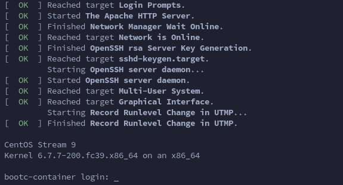

# Use Case - Simple bootc container

This example shows a very simple example of a bootc container the is built starting from a *centos-bootc* image.

The Containerfile in the example:

- Updates packages
- Installs tmux and mkpasswd to create a simple user password
- Creates a *bootc-user* user in the image
- Adds the wheel group to sudoers

To build the image:

```bash
podman build -f Containerfile.simple -t bootc-simple-image .
```

You can now run it using:

```bash
podman run -it --name bootc-container --hostname bootc-container -p 2022:22 bootc-simple-image
```

Note: The *"-p 2022:22"* part forwards the container's SSH port to the host 2022 port.

The contaienr will now start and a login prompt will appear:



You can simply login with *bootc-user/redhat* and play around with the container content!

## Example Containerfile

```dockerfile
FROM quay.io/centos-bootc/centos-bootc:stream9
RUN dnf -y update && dnf -y install tmux mkpasswd
RUN pass=$(mkpasswd --method=SHA-512 --rounds=4096 redhat) && useradd -m -G wheel bootc-user -p $pass
RUN echo "%wheel        ALL=(ALL)       NOPASSWD: ALL" > /etc/sudoers.d/wheel-sudo
CMD [ "/sbin/init" ]
```