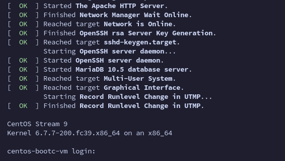
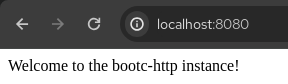
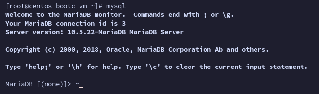

# Use Case - Upgrading a VM based on a bootc image

In this example, we want to add some bits to the [previously generated httpd image](../anaconda-ks-bootc-container/) to add a [MariaDB server](https://mariadb.org/) and a text editor, [VIM](https://www.vim.org/).

We will then use **bootc** to manage the system update, and you will see how easy and fast perfoming upgrades is.

The [Containerfile](./Containerfile.upgrade) will be very close to the [previous one](../anaconda-ks-bootc-container/Containerfile.anaconda):

- Updates packages
- Installs tmux and mkpasswd to create a simple user password
- Creates a *bootc-user* user in the image
- Adds the wheel group to sudoers
- Installs [Apache Server](https://httpd.apache.org/)
- Enables the systemd unit for httpd
- Adds a custom index.html
- Customizes the Message of the day

But it will add the following two steps, resulting in a different image with an additional layer:

**- Add an additional message of the day with the upgrade notes**
**- Add mariadb-server package and vim**
**- Enable the mariadb systemd unit**

Since the *bootc update* command will preserve the /var and /etc content, we will use a workaround to create the needed dirs for MariaDB leveraging [systemd-tmpfiles](./files/00-mariadb-tmpfile.conf).

## Building the image

You can build the image right from the Containerfile using Podman:

```bash
podman build -f Containerfile.upgrade -t centos-bootc-vm:httpd .
```

## Testing the image

You can now test it using:

```bash
podman run -it --name centos-bootc-vm --hostname centos-bootc-vm -p 8080:80 -p 3306:3306 centos-bootc-vm:httpd
```

Note: The *"-p 8080:80" -p 3306:3306* part forwards the container's *http* and *mariadb* port to the port 8080 and 3306 on the host to test that httpd and mariadb are working.


The contaienr will now start and a login prompt will appear:



### Testing Apache

On another terminal tab or in your browser, you can verify that the httpd server is working and serving traffic.

**Terminal**

```bash
 ~ ▓▒░ curl localhost:8080                                                                                                           ░▒▓ ✔  11:59:44
Welcome to the bootc-http instance!
```

**Browser**



### Testing Mariadb

From the login prompt, login as **bootc-user/redhat** and impersonate the root user:

```bash
[bootc-user@centos-bootc-vm ~]$ sudo -i
[root@centos-bootc-vm ~]#
```

Verify that mariadb is running:

```bash
mysql
```

You should be able to connect to mariadb:



## Tagging and pushing the image

To tag and push the image you can simply run (replace **YOURQUAYUSERNAME** with the account name):


```bash
export QUAY_USER=YOURQUAYUSERNAME
```

```bash
podman tag centos-bootc-vm:httpd quay.io/$QUAY_USER/centos-bootc-vm:httpd
```

Log-in to Quay.io:

```bash
podman login -u $QUAY_USER quay.io
```

And push the image:

```bash
podman push quay.io/$QUAY_USER/centos-bootc-vm:httpd
```

You can now browse to [https://quay.io/repository/YOURQUAYUSERNAME/centos-bootc-httpd?tab=settings](https://quay.io/repository/YOURQUAYUSERNAME/centos-bootc-httpd?tab=settings) and ensure that the repository is set to **"Public"**.


## Updating the VM with the newly created image

The first thing to do is logging in the VM created in the [previous use case](../anaconda-ks-bootc-container/):

```bash
 ~ ▓▒░ ssh bootc-user@192.168.150.228
Warning: Permanently added '192.168.150.228' (ED25519) to the list of known hosts.
bootc-user@192.168.150.228's password:
This is a CentOS Stream 9 VM installed using a bootable container as an rpm-ostree source!
Last login: Sat Mar 16 15:13:05 2024
[bootc-user@localhost ~]$
```

Verify that bootc is installed:

```bash
[bootc-user@localhost ~]$ bootc --help
Deploy and transactionally in-place with bootable container images.

The `bootc` project currently uses ostree-containers as a backend to support a model of bootable container images.  Once installed, whether directly via `bootc install` (executed as part of a container) or via another mechanism such as an OS installer tool, further updates can be pulled via e.g. `bootc upgrade`.

Changes in `/etc` and `/var` persist.

Usage: bootc <COMMAND>

Commands:
  upgrade      Download and queue an updated container image to apply
  switch       Target a new container image reference to boot
  edit         Apply full changes to the host specification
  status       Display status
  usr-overlay  Add a transient writable overlayfs on `/usr` that will be discarded on reboot
  install      Install the running container to a target
  help         Print this message or the help of the given subcommand(s)

Options:
  -h, --help   Print help (see a summary with '-h')
```

Note that among the options we have the **upgrade** option that we will be using in this use case.
The upgrade option allows checking, fetching and using any updated container image corresponding to the *imagename:tag* we used, in this case **quay.io/YOURQUAYUSERNAME/centos-bootc-vm:httpd**

The upgrade command requires higher privileges to run, let's perform the upgrade!

```bash
[bootc-user@localhost ~]$ sudo bootc upgrade
layers already present: 71; layers needed: 1 (78.9 MB)
 75.25 MiB [████████████████████] (0s) Fetched layer sha256:12ee1bb92676                                                                                                                                                                                                                                                                                                                                        Loading usr/lib/ostree/prepare-root.conf
Queued for next boot: ostree-unverified-registry:quay.io/kubealex/centos-bootc-vm:httpd
  Version: stream9.20240311.0
  Digest: sha256:4a11bb47173188a0ff8c9fc65be45c802a7df2d32b662fba2445b589312e0cd4
Total new layers: 72    Size: 1.0 GB
Removed layers:   1     Size: 407 bytes
Added layers:     1     Size: 78.9 MB
```

As you can see, at the beginning it performs a comparison between the actual rpm-ostree image that the system is booted from and the new image, fetching **only the additional layer** corresponding to the updates introduced during the last build.

Verify that mariadb is still not present at this time, and proceed with a reboot:

```bash
[bootc-user@localhost ~]$ systemctl status mariadb
Unit mariadb.service could not be found.
[bootc-user@localhost ~]$ sudo reboot
```

Let's log back in!

```bash
 ~ ▓▒░ ssh bootc-user@192.168.150.228
bootc-user@192.168.150.228's password:
This is a CentOS Stream 9 VM installed using a bootable container as an rpm-ostree source!
This server now supports MariaDB as a database, after last update
Last login: Sat Mar 16 15:40:55 2024 from 192.168.150.1
[bootc-user@localhost ~]$
```

You can already see that something changed, we have a new line in our message of the day, let's see if mariadb is running and test it using the default root user that is created by default (using sudo!):

```bash
[bootc-user@localhost ~]$ systemctl status mariadb
● mariadb.service - MariaDB 10.5 database server
     Loaded: loaded (/usr/lib/systemd/system/mariadb.service; enabled; preset: disabled)
     Active: active (running) since Sat 2024-03-16 15:46:48 CET; 1min 47s ago
       Docs: man:mariadbd(8)
             https://mariadb.com/kb/en/library/systemd/
    Process: 636 ExecStartPre=/usr/libexec/mariadb-check-socket (code=exited, status=0/SUCCESS)
    Process: 684 ExecStartPre=/usr/libexec/mariadb-prepare-db-dir mariadb.service (code=exited, status=0/SUCCESS)
    Process: 1023 ExecStartPost=/usr/libexec/mariadb-check-upgrade (code=exited, status=0/SUCCESS)
   Main PID: 934 (mariadbd)
     Status: "Taking your SQL requests now..."
      Tasks: 8 (limit: 23140)
     Memory: 92.4M
        CPU: 172ms
     CGroup: /system.slice/mariadb.service
             └─934 /usr/libexec/mariadbd --basedir=/usr

Mar 16 15:46:48 localhost.localdomain mariadbd[934]: 2024-03-16 15:46:48 0 [Note] InnoDB: 10.5.22 started; log sequence number 45103; transaction id 20
Mar 16 15:46:48 localhost.localdomain mariadbd[934]: 2024-03-16 15:46:48 0 [Note] Plugin 'FEEDBACK' is disabled.
Mar 16 15:46:48 localhost.localdomain mariadbd[934]: 2024-03-16 15:46:48 0 [Note] InnoDB: Loading buffer pool(s) from /var/lib/mysql/ib_buffer_pool
Mar 16 15:46:48 localhost.localdomain mariadbd[934]: 2024-03-16 15:46:48 0 [Note] InnoDB: Buffer pool(s) load completed at 240316 15:46:48
Mar 16 15:46:48 localhost.localdomain mariadbd[934]: 2024-03-16 15:46:48 0 [Note] Server socket created on IP: '::'.
Mar 16 15:46:48 localhost.localdomain mariadbd[934]: 2024-03-16 15:46:48 0 [Note] Reading of all Master_info entries succeeded
```

```bash
[bootc-user@localhost ~]$ sudo mysql
Welcome to the MariaDB monitor.  Commands end with ; or \g.
Your MariaDB connection id is 7
Server version: 10.5.22-MariaDB MariaDB Server

Copyright (c) 2000, 2018, Oracle, MariaDB Corporation Ab and others.

Type 'help;' or '\h' for help. Type '\c' to clear the current input statement.

MariaDB [(none)]>
```

Here we go, our image is updated and fully working. Of course we can use the new image to provision similar VMs that need the same pieces of software on them.
